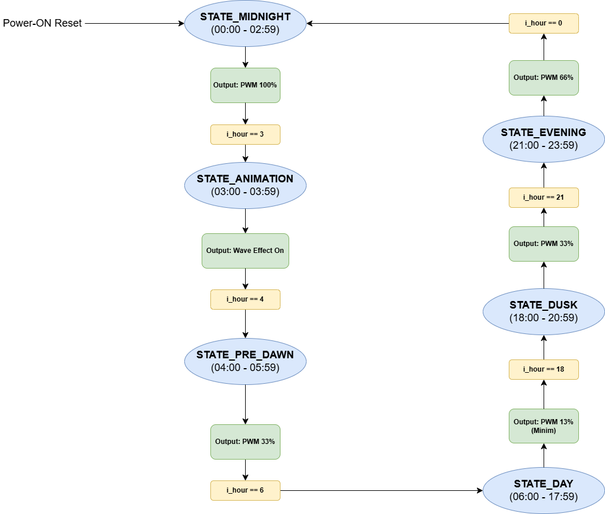

# Basys3 LED Lighting System

# Technical Description
Verilog implementation of a real-time lighting control system designed for the Basys3 FPGA board.  
This project features a deterministic Real-Time Clock (RTC) engine that orchestrates power-efficient LED dimming through 16-channel PWM regulation. It integrates an automated intensity scheduler and a hardware-driven "wave" animation engine, optimized for low resource utilization and timing-clean performance.  

# Architecture
The architecture combines several hardware modules, including a **debounced user-controlled clock**, a **seven-segment multiplexed display**, a parameterized **PWM generator**, and a custom **LED animation unit**. **Control logic** ties these components together to form a deterministic **real-time illumination system**.

# Objectives
The primary objective was to design a reliable and fully synthesizable FPGA lighting system capable of:  
* **Implementing a deterministic RTC-driven engine for automated brightness adjustment across 6 distinct time intervals.**  
* **Parameterizable 16-channel PWM regulation to ensure stable duty-cycle control for high-efficiency illumination.**  
* **Executing a complex "wave-effect" animation at 03:00 using a shift-logic pattern generator implemented in hardware.**  
* **Eliminating asynchronous signal hazards and button bouncing through advanced input conditioning (Synchronizers & Debouncers).**  
* **Time-Division Multiplexed (TDM) control of a 4-digit seven-segment display for accurate time monitoring.**  

# FSM Logic  
The system's "intelligence" is governed by a Moore-type state machine (interval-based) that dictates the illumination policy:
## Lighting Controller Logic  
Manages the transition between intensity states (DAY, DUSK, EVENING, MIDNIGHT, ANIMATION) based on the 24-hour hardware counter.  
 

  

  

# Skills
This project demonstrates proficiency in:  
**→ RTL Design and modular Verilog architecture for Xilinx Artix-7 FPGAs.**  
**→ Power Management via PWM (Pulse Width Modulation) at the hardware level.**  
**→ Handling Metastability and asynchronous clock domain inputs via synchronization stages.**  
**→ Verification and Validation (V&V) through professional Testbench simulation and waveform analysis.**  
**→ Industry-standard coding conventions (parameterized modules, prefix-based naming conventions).**  
**→ FPGA Resource Optimization (LUT and Flip-Flop efficiency).**  

# Testing
The design underwent a rigorous Verification & Validation flow:   
**1. RTL Simulation:** Validated using a professional Testbench (`tb_top_module.v`), confirming correct PWM duty-cycle transitions and animation timing.  
**2. Hardware Verification:** Fully synthesized and implemented on the `Basys3 board`.  
Testing confirmed `zero-latency responses`, `stable SSD multiplexing` (~760Hz refresh rate) and `accurate RTC tracking`.  
Timing analysis in Vivado confirmed a **Positive Slack** at 100MHz, ensuring no setup or hold time violations.  

# Key Technologies
`Verilog HDL`, `Artix-7 (Basys3)`, `Xilinx Vivado`, `PWM Dimming`, `RTL Design`, `RTC Logic`, `TDM Multiplexing`, `Digital Logic Synthesis`, `Hardware Verification`. 
